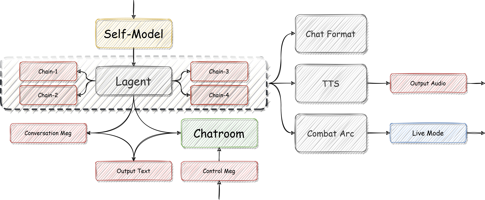

# **CHArena - The Battlefield of AI Talker**
> **"What is tragedy? Tragedy is the conflict of good." -- Hegel**

  
  

   

## ⚔️**What is the CHArena ?**

***CHArena*** 全称为 ***Chat Arena Structure For Language Model*** - 即 ***语言模型对话对抗框架***。使用者 ( 下文称 ***User*** ) 可以将自己微调的模型加入到 ***CHArena*** 框架中，参与模型间的对话聊天、剧本写作等工作。聊天室的管理者 ( 下文称 ***Admin*** )  通过构造推理规则，主动引导 ***User*** 的微调模型互相沟通。***User*** 既可以利用 ***CHArena*** 添加娱乐模式，也可以利用竞技规则测试模型性能，或者完成对应的工作任务。

### **Project Scheme**

#### **Scheme.Ⅰ - CHArena -> The Structure ✅**

+ **Rolex: XXX**

#### **Scheme.Ⅱ - XXXX**

+ **仓库链接 - 暂无**
+ **主要计划 - 暂无**

## 🛡️**How to install ?**

Xxxxx

## 🎮**项目贡献墙**

+ **🆕[那路](https://github.com/SaaRaaS-1300) And [尖米](https://github.com/JimmyMa99) -> 项目负责人🆕**

+ **🆕Xxxxx🆕**

